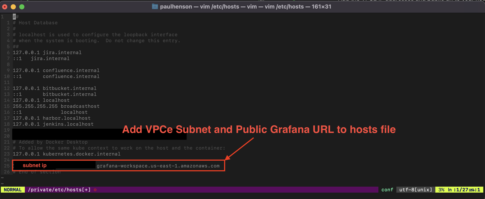

# aws-managed-services
Contains AWS managed services.

## AMG Private VPC Connectivity

To set up AMG to work with a VPC you must provide the `vpc_private_subnets` and `vpc_security_group_ids` inputs. This will set up the outbound VPC connections.

If you want to restrict traffic to AMG we need to set up Network Access Controls. You **can** provide a prefix list via the `nac_prefix_list_ids` input and you **must** provide the vpc endpoint via the `vpc_endpoint_ids` input. 

If you do not provide the nac_configuration then AMG will be open to the internet and can be publicly accessed through the URL generated by the workspace.

When you set up NAC the VPC endpoint URL will not have a route to the public URL that the Grafana workspace provides, so you will need to establish that route yourself in some way. Below are some possible solutions you could implement: 

- Add the VPCE IP addresses and public url to your hosts file.

    **Example**: 
    
    <ip address> <workspace-id>.grafana-workspace.<region>.amazonaws.com
    

    The IP address is the subnet associated with the VPCE. You can find it by navigating to the VPC dashboard, selecting **Endpoints** and opening your VPC endpoint.
    
    The URL is the Public URL provided by the Grafana workspace when created. You can find it by navigating to Amazon Managed Grafana, clicking on workspace, and selecting your grafana workspace.
    

- Implement a reverse proxy inside the VPC that will redirect to the public url.

    **_NOTE:_** This is an assumption as we have not tested it.

- Have DNS infrastructure resolve to the VPCE DNS instead of the public.
[Route 53 Resolver endpoints and forwarding rule](https://docs.aws.amazon.com/whitepapers/latest/hybrid-cloud-dns-options-for-vpc/route-53-resolver-endpoints-and-forwarding-rules.html)

    **_NOTE:_** This is an assumption as we have not tested it.

## Terraform Documentation

<!-- BEGIN_TF_DOCS -->
## Requirements

| Name | Version |
|------|---------|
|  [terraform](#requirement\_terraform) | >= 1.1.0 |
|  [aws](#requirement\_aws) | >= 5.7.0 |
|  [awscc](#requirement\_awscc) | >= 0.24.0 |
|  [grafana](#requirement\_grafana) | >= 2.1.0 |

## Providers

| Name | Version |
|------|---------|
|  [aws](#provider\_aws) | >= 5.7.0 |
|  [grafana](#provider\_grafana) | >= 2.1.0 |

## Modules

| Name | Source | Version |
|------|--------|---------|
|  [managed\_grafana](#module\_managed\_grafana) | github.com/liatrio/terraform-aws-managed-service-grafana.git | n/a |
|  [managed\_prometheus](#module\_managed\_prometheus) | terraform-aws-modules/managed-service-prometheus/aws | n/a |

## Resources

| Name | Type |
|------|------|
| [aws_cloudfront_distribution.s3_distribution](https://registry.terraform.io/providers/hashicorp/aws/latest/docs/resources/cloudfront_distribution) | resource |
| [aws_iam_role.amp_iam_role](https://registry.terraform.io/providers/hashicorp/aws/latest/docs/resources/iam_role) | resource |
| [aws_iam_role_policy.amp_role_policy](https://registry.terraform.io/providers/hashicorp/aws/latest/docs/resources/iam_role_policy) | resource |
| [aws_kms_key.secrets](https://registry.terraform.io/providers/hashicorp/aws/latest/docs/resources/kms_key) | resource |
| [aws_prometheus_alert_manager_definition.this](https://registry.terraform.io/providers/hashicorp/aws/latest/docs/resources/prometheus_alert_manager_definition) | resource |
| [aws_prometheus_workspace.amp_ws](https://registry.terraform.io/providers/hashicorp/aws/latest/docs/resources/prometheus_workspace) | resource |
| [aws_route53_record.s3_alias](https://registry.terraform.io/providers/hashicorp/aws/latest/docs/resources/route53_record) | resource |
| [aws_route53_zone.private](https://registry.terraform.io/providers/hashicorp/aws/latest/docs/resources/route53_zone) | resource |
| [aws_s3_bucket.amg_bucket](https://registry.terraform.io/providers/hashicorp/aws/latest/docs/resources/s3_bucket) | resource |
| [aws_s3_bucket_public_access_block.amg_bucket](https://registry.terraform.io/providers/hashicorp/aws/latest/docs/resources/s3_bucket_public_access_block) | resource |
| [aws_s3_bucket_website_configuration.amg_bucket_website](https://registry.terraform.io/providers/hashicorp/aws/latest/docs/resources/s3_bucket_website_configuration) | resource |
| [aws_secretsmanager_secret.grafana_api_token](https://registry.terraform.io/providers/hashicorp/aws/latest/docs/resources/secretsmanager_secret) | resource |
| [aws_secretsmanager_secret.grafana_sa_token](https://registry.terraform.io/providers/hashicorp/aws/latest/docs/resources/secretsmanager_secret) | resource |
| [aws_secretsmanager_secret_version.sa_version](https://registry.terraform.io/providers/hashicorp/aws/latest/docs/resources/secretsmanager_secret_version) | resource |
| [aws_secretsmanager_secret_version.sversion](https://registry.terraform.io/providers/hashicorp/aws/latest/docs/resources/secretsmanager_secret_version) | resource |
| [grafana_service_account.admin](https://registry.terraform.io/providers/grafana/grafana/latest/docs/resources/service_account) | resource |
| [grafana_service_account_token.admin_service_account_token](https://registry.terraform.io/providers/grafana/grafana/latest/docs/resources/service_account_token) | resource |
| [aws_grafana_workspace.this](https://registry.terraform.io/providers/hashicorp/aws/latest/docs/data-sources/grafana_workspace) | data source |
| [aws_region.current](https://registry.terraform.io/providers/hashicorp/aws/latest/docs/data-sources/region) | data source |

## Inputs

| Name | Description | Type | Default | Required |
|------|-------------|------|---------|:--------:|
|  [account\_access\_type](#input\_account\_access\_type) | The account access type. | `string` | `"CURRENT_ACCOUNT"` | no |
|  [alert\_manager\_config](#input\_alert\_manager\_config) | The contents of the alarm rules file. | `string` | `"  alertmanager_config: |\n      route:\n        receiver: 'default'\n      receivers:\n        - name: 'default'\n"` | no |
|  [amg\_redirect\_hostname](#input\_amg\_redirect\_hostname) | The hostname to which the S3 bucket will redirect requests | `string` | `""` | no |
|  [amp\_create\_workspace](#input\_amp\_create\_workspace) | Specifies if the AMP workspace has to be created or not | `bool` | `true` | no |
|  [amp\_workspace\_id](#input\_amp\_workspace\_id) | If 'amp\_create\_workspace' is set to 'false' then a workspace has to be supplied. | `string` | `""` | no |
|  [amp\_ws\_alias](#input\_amp\_ws\_alias) | The alias of the AMP workspace | `string` | `"observability-amp-workspace"` | no |
|  [asm\_api\_token\_secret\_name](#input\_asm\_api\_token\_secret\_name) | ASM secret name for the API token to be stored in | `string` | n/a | yes |
|  [asm\_sa\_token\_secret\_name](#input\_asm\_sa\_token\_secret\_name) | ASM secret name for the service account token to be stored in | `string` | n/a | yes |
|  [authentication\_providers](#input\_authentication\_providers) | List containing the methods used to authenticate. | `list(any)` | n/a | yes |
|  [aws\_region](#input\_aws\_region) | AWS Region | `string` | `"us-east-1"` | no |
|  [aws\_route53\_zone\_tags](#input\_aws\_route53\_zone\_tags) | value of the private hosted zone tags | `map(string)` | `{}` | no |
|  [create](#input\_create) | Determines whether a resources will be created | `bool` | `true` | no |
|  [create\_dashboard\_folder](#input\_create\_dashboard\_folder) | Boolean flag to enable Amazon Managed Grafana folder and dashboards | `bool` | `true` | no |
|  [create\_iam\_role](#input\_create\_iam\_role) | Determines whether a an IAM role is created or to use an existing IAM role | `bool` | `true` | no |
|  [create\_prometheus\_data\_source](#input\_create\_prometheus\_data\_source) | Boolean flag to enable Amazon Managed Grafana datasource | `bool` | `true` | no |
|  [create\_saml\_configuration](#input\_create\_saml\_configuration) | Flag to indicate whether or not to create a SAML configuratino in Grafana Workspace. | `string` | `false` | no |
|  [create\_workspace](#input\_create\_workspace) | Determines whether a workspace will be created or to use an existing workspace | `bool` | `true` | no |
|  [data\_sources](#input\_data\_sources) | List of data sources to create in the workspace | `list(string)` | <pre>[   "CLOUDWATCH",   "PROMETHEUS",   "XRAY" ]</pre> | no |
|  [enable\_alertmanager](#input\_enable\_alertmanager) | Creates Amazon Managed Service for Prometheus AlertManager for all workloads | `bool` | `false` | no |
|  [enable\_managed\_prometheus](#input\_enable\_managed\_prometheus) | Creates a new Amazon Managed Service for Prometheus Workspace | `bool` | `true` | no |
|  [environment](#input\_environment) | Environment name | `string` | n/a | yes |
|  [generate\_metadata\_url](#input\_generate\_metadata\_url) | Boolean on whether or not to generate the metadata url | `bool` | `false` | no |
|  [iam\_role\_arn](#input\_iam\_role\_arn) | Existing IAM role ARN for the workspace. Required if `create_iam_role` is set to `false` | `string` | `null` | no |
|  [iam\_role\_name](#input\_iam\_role\_name) | The name of the IAM Role to create or associate with | `string` | `"aws-observability-workspace-iam-role"` | no |
|  [idp\_url\_with\_postfix](#input\_idp\_url\_with\_postfix) | The FQDN of the IDP metadata URL with a postfix as needed to generate the metadata IDP url. Works for Ping | `string` | `""` | no |
|  [logging\_configuration](#input\_logging\_configuration) | Map that contains the logging configuration for prometheus. | `map(string)` | `{}` | no |
|  [managed\_grafana\_workspace\_id](#input\_managed\_grafana\_workspace\_id) | Amazon Managed Grafana Workspace ID | `string` | `""` | no |
|  [managed\_prometheus\_workspace\_id](#input\_managed\_prometheus\_workspace\_id) | Amazon Managed Service for Prometheus Workspace ID | `string` | `""` | no |
|  [managed\_prometheus\_workspace\_region](#input\_managed\_prometheus\_workspace\_region) | Region where Amazon Managed Service for Prometheus is deployed | `string` | `null` | no |
|  [nac\_configuration](#input\_nac\_configuration) | The configuration settings for an Amazon VPC that contains data sources for your Grafana workspace to connect to | `any` | `{}` | no |
|  [name](#input\_name) | The name of the deployment | `string` | `"aws-o11y-managed-services"` | no |
|  [route53\_hosted\_zone\_name](#input\_route53\_hosted\_zone\_name) | value of the private hosted zone name | `string` | `""` | no |
|  [s3\_website\_endpoint\_zone\_ids](#input\_s3\_website\_endpoint\_zone\_ids) | S3 website endpoint zone IDs by region | `map(string)` | <pre>{   "us-east-1": "Z3AQBSTGFYJSTF",   "us-west-1": "Z2F56UZL2M1ACD",   "us-west-2": "Z3BJ6K6RIION7M" }</pre> | no |
|  [saml\_admin\_role\_values](#input\_saml\_admin\_role\_values) | Name of the admin role value. | `list(any)` | `[]` | no |
|  [saml\_editor\_role\_values](#input\_saml\_editor\_role\_values) | Name of the editor role value. | `list(any)` | `[]` | no |
|  [saml\_email\_assertion](#input\_saml\_email\_assertion) | Name of the saml email used for assertion. | `string` | `""` | no |
|  [saml\_groups\_assertion](#input\_saml\_groups\_assertion) | Name of the saml groups used for assertion. | `string` | `""` | no |
|  [saml\_idp\_metadata\_url](#input\_saml\_idp\_metadata\_url) | IDP Meta data url. | `string` | `""` | no |
|  [saml\_login\_assertion](#input\_saml\_login\_assertion) | Method of login used for assertion. | `string` | `""` | no |
|  [saml\_name\_assertion](#input\_saml\_name\_assertion) | Display name for SAML. | `string` | `""` | no |
|  [saml\_org\_assertion](#input\_saml\_org\_assertion) | Name of the org used for assertion. | `string` | `""` | no |
|  [saml\_role\_assertion](#input\_saml\_role\_assertion) | Name of the role used for assertion. | `string` | `""` | no |
|  [tags](#input\_tags) | Additional tags (e.g. `map('BusinessUnit`,`XYZ`) | `map(string)` | <pre>{   "GithubOrg": "aws-observability",   "GithubRepo": "terraform-aws-observability-accelerator" }</pre> | no |
|  [use\_iam\_role\_name\_prefix](#input\_use\_iam\_role\_name\_prefix) | Whether or not to use a prefix on the IAM Role name | `bool` | `true` | no |
|  [vpc\_configuration](#input\_vpc\_configuration) | The configuration settings for an Amazon VPC that contains data sources for your Grafana workspace to connect to | `any` | `{}` | no |
|  [vpc\_ids](#input\_vpc\_ids) | List of VPC IDs | `list(string)` | `[]` | no |

## Outputs

| Name | Description |
|------|-------------|
|  [amg\_route53\_alias](#output\_amg\_route53\_alias) | value for the route53 alias, which contains the bucket name, hosted zone id and amg fqdn |
|  [aws\_region](#output\_aws\_region) | AWS Region |
|  [create](#output\_create) | The creatae flag that gets passed to the module. |
|  [create\_workspace](#output\_create\_workspace) | The create\_workspace flag that gets passed to the module. |
|  [managed\_grafana\_workspace\_endpoint](#output\_managed\_grafana\_workspace\_endpoint) | Amazon Managed Grafana workspace endpoint |
|  [managed\_grafana\_workspace\_id](#output\_managed\_grafana\_workspace\_id) | Amazon Managed Grafana workspace ID |
|  [managed\_prometheus\_workspace\_id](#output\_managed\_prometheus\_workspace\_id) | Amazon Managed Prometheus workspace ID |
<!-- END_TF_DOCS -->

